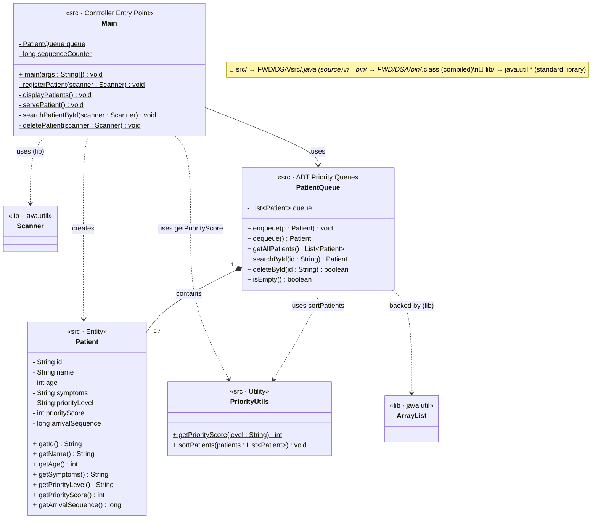

# DSA – Hospital Patient Priority Handling System
## UML Class Diagram + System Architecture

---

## 1. Project Directory Structure

```
FWD/DSA/
├── src/                        ← Java source files
│   ├── Main.java               ← Entry point & controller
│   ├── Patient.java            ← Data model / entity
│   ├── PatientQueue.java       ← ADT – Priority Queue
│   └── PriorityUtils.java      ← Utility / helper
│
├── bin/                        ← Compiled .class output (javac)
│   ├── Main.class
│   ├── Patient.class
│   ├── PatientQueue.class
│   └── PriorityUtils.class
│
├── lib/                        ← External dependencies (JARs)
│   └── README.md               ← (No JARs needed – uses java.util)
│
├── Main.java                   ← Root copies (direct compile fallback)
├── Patient.java
├── PatientQueue.java
├── PriorityUtils.java
└── UML_Diagram.md / .png
```

---

## 2. System Architecture (Layered View)

```
╔══════════════════════════════════════════════════════════════╗
║              [ lib/ ]  External Libraries                    ║
║    java.util.Scanner  │  java.util.ArrayList │ java.util.List║
║        (No external JARs — Standard Library only)            ║
╚══════════════════════════════════════════════════════════════╝
                              ▲ imports
╔══════════════════════════════════════════════════════════════╗
║              [ src/ ]  Java Source Files                     ║
╠════════════════╦══════════════════╦═══════════╦═════════════╣
║   Main.java    ║ PatientQueue.java ║Patient.java║PriorityUtils║
║ <<Controller>> ║  <<ADT / PQ>>    ║ <<Entity>> ║ <<Utility>> ║
║ Entry point    ║ ArrayList-backed ║ 7 fields   ║ Bubble Sort ║
║ Menu I/O       ║ enqueue/dequeue  ║ getters    ║ getScore    ║
╚════════════════╩══════════════════╩═══════════╩═════════════╝
                    │  javac -d bin/ src/*.java
                    ▼
╔══════════════════════════════════════════════════════════════╗
║              [ bin/ ]  Compiled .class Output                ║
║  Main.class │ PatientQueue.class │ Patient.class │ PriorityUtils.class ║
╚══════════════════════════════════════════════════════════════╝
                    │  java -cp bin/ Main
                    ▼
╔══════════════════════════════════════════════════════════════╗
║              [ Terminal / Console ]                          ║
║         Menu-driven CLI – User interacts at runtime          ║
╚══════════════════════════════════════════════════════════════╝
```

---

## 3. UML Class Diagram



---

## 4. Build & Run Commands

```bash
# Compile src → bin
javac -d bin/ src/*.java

# Run from bin
java -cp bin/ Main
```

---

## 5. DSA Concepts Mapped

| Layer | DSA Concept | Class / Method |
|-------|------------|----------------|
| src   | **Bubble Sort** | `PriorityUtils.sortPatients()` |
| src   | **Linear Search** | `PatientQueue.searchById()` |
| src   | **Priority Queue (ADT)** | `PatientQueue` – enqueue / dequeue |
| src   | **ArrayList (dynamic array)** | `PatientQueue.queue` |
| src   | **Encapsulation (OOP)** | `Patient` – all fields private |
| lib   | **Java Collections** | `java.util.List`, `java.util.ArrayList` |
| lib   | **I/O** | `java.util.Scanner` |
| bin   | **Bytecode** | Compiled `.class` files |

---

## 6. CO Attainment

| CO | Description | Files (src/) |
|----|-------------|-------------|
| **CO1** | Algorithm Analysis, Searching & Sorting | `PriorityUtils`, `PatientQueue`, `Main` |
| **CO2** | Abstract Data Types (ADTs) | `PatientQueue`, `Main` |
| **CO3** | Stack / Queue Concepts | `PatientQueue`, `Main` |
| **CO4** | Java Collections (lib/java.util) | `PatientQueue` |
| CO5 | Not attained | — |
| CO6 | Not attained | — |
